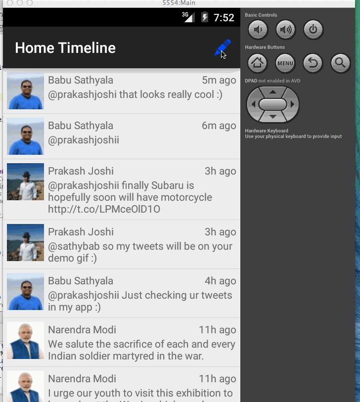

# Simple Twitter Client
Twitter Client App is a simple Twitter client that supports viewing a Twitter timeline using OAuth authentication.

# User Stories:
* User can sign in to Twitter using OAuth login
* User can view the tweets from their home timeline
** User should be displayed the username, name, and body for each tweet
** User should be displayed the relative timestamp for each tweet "8m", "7h"

# Simple Twitter Client

